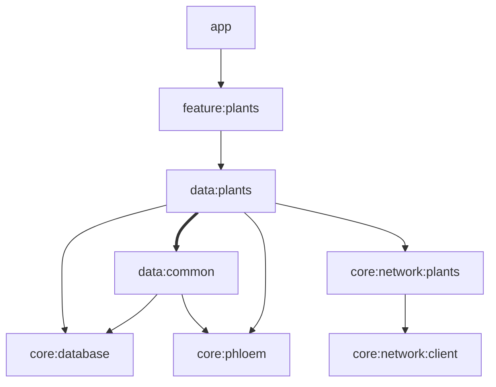

# Leaflet

An offline-first Android plant catalog built with Jetpack Compose. Browse, search and filter
thousands of species from the [Perenual](https://perenual.com/docs/api) API, save favorites,
and read care details, all backed by a local Room cache that keeps working without a network.

<!-- TODO: screenshots (browse, filters, detail) -->

## Features

- **Browse** an infinite, paged plant catalog cached locally for offline use.
- **Search and filter** by light, watering, pet/child safety, care level and mature size.
- **Save** plants and view them via a saved filter on the browse screen.
- **Plant details** fetched on demand and cached for a week.
- **Plantings** tab (planned) for tracking your own plants and care events.

## Tech stack

| Area         | Libraries                                           |
|--------------|-----------------------------------------------------|
| UI           | Jetpack Compose (Material 3), Navigation 3, Coil 3  |
| Architecture | MVVM, Kotlin Coroutines + Flow, Paging 3            |
| Data         | Room 3, Ktor 3, kotlinx.serialization               |
| DI           | Koin 4                                              |
| Build        | Gradle convention plugins, version catalog, AGP 9   |
| Testing      | JUnit 4, Robolectric, Compose UI test, coroutines-test |

## Getting started

Requirements: Android Studio (recent), JDK 17+ (CI uses 21), and a free
[Perenual API key](https://perenual.com/docs/api).

Add the key to `local.properties` (or set the `PERENUAL_API_KEY` environment variable):

```properties
PERENUAL_API_KEY=your-key-here
```

Build and install:

```bash
./gradlew installDebug
```

### Data source limits

Perenual's free tier is heavily rate limited: about 100 requests per day at the time of
writing, and detailed care data covers only part of the catalog. See
[Perenual pricing](https://perenual.com/subscription-api-pricing) for current limits. With a
free key, expect browsing to stall once the daily quota runs out. Anything already
fetched stays available offline from the local cache, and the next scroll resumes the pull.

Perenual may be replaced. Swapping providers means updating the `core:network:plants` module to the
new source and creating new mapping in `data:plants`.

## Architecture

### Modules



Thick arrows represent `api` dependencies, and thin arrows represent `implementation` dependencies.

Two shared modules are left out of the graph for readability: `core:designsystem`, and `core:time`.

### Phloem - sync engine

Phloem moves data from remote APIs into Room, and the UI only ever reads from Room.
Pulls are resumable, TTL-gated and transactional, and failures surface as typed errors.
Design details are in [core/phloem/README.md](core/phloem/README.md).

How the app uses it:

- **Catalog:** a Paging 3 `RemoteMediator` drives `PhloemPageFetcher`, so pages are fetched
  as the user scrolls. A complete pass stays fresh for 24 hours.
- **Plant details:** `PhloemItemFetcher` refreshes them cache-through into the same table
  the catalog uses. They stay fresh for 7 days unless the user forces a refresh.

## Testing

Unit tested classes include: ViewModels, Repositories, UseCases, DAOs, DTO parsing, the Phloem
fetcher and Compose UI.

Run the unit test suite (same as CI):

```bash
./gradlew testDebugUnitTest :core:phloem:test :core:network:plants:test :core:network:client:test :core:time:test
```

**Contract tests** hit the live Perenual API to catch schema drift. They are excluded from
`check` to protect the rate limit. They use the same `PERENUAL_API_KEY` as the app and are skipped
when it isn't set:

```bash
./gradlew :core:network:plants:contractTest
```

## CI 
GitHub Actions builds the debug APK and runs the unit suite on every push and pull
request, then posts a summary of any failing tests to the job page.

Every build, local or CI, publishes a [Gradle Build Scan](https://scans.gradle.com).
